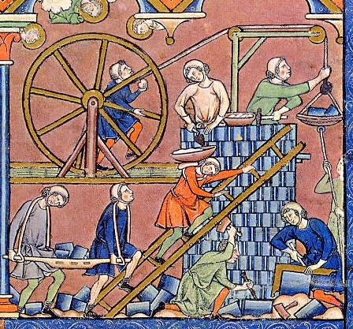

  

<h1 align="center">Freemason Build System</h1>

### Documentation
* [User guide](user-guide/freemason-user-guide.pdf)
* <a href="https://raw.githubusercontent.com/formalism-labs/freemason.docs/refs/heads/main/user-guide/freemason-user-guide.pdf" target="_blank">User guide</a>
* [Introduction](intro/introduction-to-freemason.pdf)
* [Technical review](design/freemason-tech-review.pdf)
